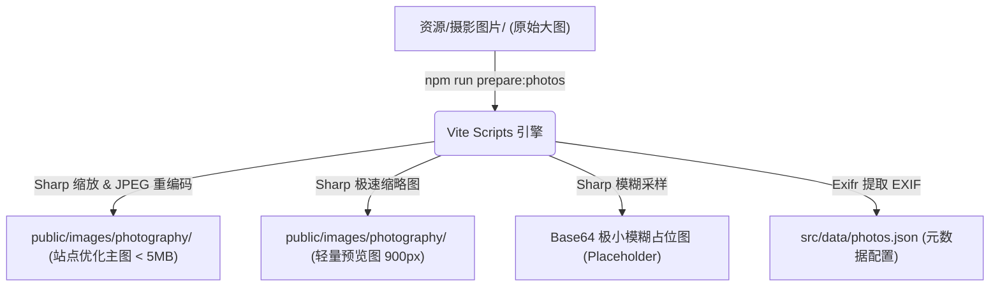

# 無影集 | SEEN BY NOTHING

[]()
[]()
[]()
[]()

> 「无影，则万物皆影。」
>
> **無影集 (SEEN BY NOTHING)** 是一个长期维护的静态摄影作品集网站。项目致力于通过黑白主导的极简主义设计、克制的色彩搭配以及平面设计式的排版，构建一个沉浸且充满艺术感的个人摄影与未来 ZINE 作品展示空间。

---

## 📸 项目定位与视觉风格

- **正式名称**：`無影集 | SEEN BY NOTHING` (保持浏览器标题、Open Graph 标题和首页品牌文字的高度一致)。
- **视觉美学**：
  - **首页 (Homepage)**：采用黑白主导、精细结构线、大号无衬线字体排版和克制的莫兰迪重点色，融入丰富的滚动交互与 SVG 网格动效，构建强烈的艺术感与未来 ZINE 导向。
  - **主题画廊页 (Theme Gallery)**：底色使用纯白，界面控件黑字白底，通过克制的莫兰迪重点色作为状态提示。在这里，摄影作品本身是唯一的绝对主角，界面动效克制退后。
  - **信息降级**：若照片由于年代久远缺失 EXIF 元数据，详情页将优雅地显示为 `已消失`，并附文 *“不过回忆还在”*，传递摄影本真的感性叙事。

---

## 🎨 四大摄影主题

本项目摄影作品归纳为四个文学化且色彩氛围各异的专属主题：

| 主题 | 英文 (Slug) | 氛围与意境描述 |
| :--- | :--- | :--- |
| **暖** | `apricity` | 柔和的光、近处的温度，以及日常里安静停留的瞬间。 |
| **湛** | `azure` | 清透、冷静，保留天空与水面之间的呼吸感。 |
| **盛** | `lush` | 明亮而丰盛，记录色彩舒展、生命向外生长的片刻。 |
| **郁** | `pall` | 更深、更密，把视线收回到阴影、纹理与未说完的部分。 |

---

## 🛠️ 技术栈

项目基于现代前端工程化生态构建，保持高标准的类型安全与测试覆盖率：

- **核心框架**：React 19 (基于 Vite 8 构建工具)
- **开发语言**：TypeScript (开启严格模式 `strict: true`)
- **样式系统**：Tailwind CSS (响应式排版与现代 Web 布局)
- **动效引擎**：Framer Motion (流畅且符合 `prefers-reduced-motion` 动效减弱标准的渐变效果)
- **包管理**：npm workspace (多包/子应用工作流，锁定 `package-lock.json`)
- **端到端测试**：Playwright (跨 320 / 390 / 430 / 1440 等不同视口的自动化 UI 回归验证)
- **托管平台**：Cloudflare Pages 自动化构建与部署

---

## 📂 项目结构与架构设计

仓库遵循清晰的依赖边界原则，确保组件的可重用性与纯逻辑层的独立性。

### 核心目录树

```text
├── apps/
│   └── photography/              # 静态摄影站主应用
│       ├── public/
│       │   └── images/
│       │       └── photography/  # 站点实际加载的图片与预览图 (由脚本生成，已过滤)
│       ├── scripts/
│       │   ├── prepare-photos.ts # 从资源目录处理图片，重编码，提取 EXIF 写入 metadata
│       │   ├── diff-photos.ts    # 仅检测本地外部素材与当前 public 内图片的差异
│       │   └── validate-photos.ts# 严格校验元数据、图片尺寸、路径、大小和重复
│       └── src/
│           ├── app/              # 应用状态编排与全局视图状态
│           ├── pages/            # 平级页面入口 (HomePage, ThemeGalleryPage 等)
│           ├── views/            # 页面内部视图结构 (Home, Showcase 等)
│           ├── patterns/         # 组合交互 (瀑布流, 渐进图片, 详情弹层, 主题轨道)
│           ├── components/       # 小型可复用无状态 UI 控件
│           ├── lib/              # 纯逻辑层 (图片预加载, 数据解析等)
│           ├── data/             # 静态数据：photos.json (自动生成), themes.ts (主题集)
│           ├── motion/           # 动效适配工具 (支持 reduced motion)
│           ├── styles/           # 全局样式系统
│           └── types/            # TypeScript 核心类型声明
├── 资源/                          # 本地外部素材目录 (用户手动管理，已列入 .gitignore)
│   └── 摄影图片/
│       ├── Apricity/             # 暖主题原始大图
│       ├── Azure/                # 湛主题原始大图
│       ├── Lush/                 # 盛主题原始大图
│       └── Pall/                 # 郁主题原始大图
├── package.json                  # 根目录 workspaces 配置与统一命令管理
└── playwright.config.ts          # E2E 回归测试配置
```

### 🧱 依赖规则边界
为了防止代码腐化，请严格遵守以下模块引用方向：
$$\text{app} \longrightarrow \text{pages} \longrightarrow \text{views} \longrightarrow \text{patterns} \longrightarrow \text{components / lib / data / types}$$
- **禁止** `components` 依赖 `views` 或 `pages`。
- **禁止** `lib` 依赖 UI 组件.
- **禁止** 组件中硬编码单张照片 (必须由 `photos.json` 驱动)。

---

## ⚡ 图片与元数据流水线 (Asset Pipeline)

由于原始摄影照片体积庞大，项目通过自动化脚本实现了离线无损/高保真压缩、EXIF提取和渐进占位生成，**避免将未压缩的大图推送到 Git 仓库**。

### 1. 照片流转逻辑



### 2. 素材操作流

- **`npm run diff:photos`**：只报告当前外部 `资源/` 与 `public/` 的物理差异，不做任何修改。
- **`npm run prepare:photos`**：
  - 自动遍历 `资源/摄影图片/` 下的四大主题文件夹。
  - 读取源文件 EXIF 信息（拍摄时间、光圈、快门、ISO、焦距等）。
  - 对主图进行智能等比缩放并重编码为高质量 JPEG（体积控制在 5MB 以内）。
  - 生成 `900px` 宽度的预览图以优化瀑布流首屏加载，并获取几像素大小的 Base64 图片用于渐进式模糊加载。
  - 更新 `src/data/photos.json`。
- **`npm run validate:photos`**：对生成的图片元数据进行静态校验，防止路径缺失、大图超标、主题 Slug 匹配错误或图片名重复等问题。

---

## 🚀 本地开发与指令集

项目在根目录下提供了统一的 Workspace 快捷指令。

### 安装依赖
需要确保本地 Node.js 版本满足 `.nvmrc` 要求 (`>=24 <25`)：
```bash
npm install
```

### 本地启动
```bash
# 启动摄影站开发服务器 (优先运行在 5710-5720 端口范围，默认 5174)
npm run dev:photography
```

### 摄影作品维护流水线
每当在 `资源/` 中添加、删除或替换照片时，**必须**运行以下管道命令：
```bash
# 1. 检查是否有新增或减少的资源
npm run diff:photos

# 2. 从资源生成优化图片与 json 元数据
npm run prepare:photos

# 3. 校验元数据的完整性与合规性
npm run validate:photos
```

### 提交前验证
在向 GitHub 提交代码前，请运行本地一键集成测试：
```bash
# 执行完整流程（diff 检查 -> 元数据校验 -> 类型检查 -> 生产环境构建）
npm run check:photography
```

---

## 🧪 自动化测试 (E2E & Viewport)

为了保证多端视口的完美呈现与图片详情弹层的键盘可访问性，项目集成了 Playwright 测试框架：

```bash
# 运行 Playwright 自动化测试
npm run test:e2e:photography

# 运行 Playwright 的 UI 交互界面进行调试
npm run test:e2e:photography:ui
```

**适配复核要求**：
- 移动端不能出现任何横向页面溢出。
- 触控目标的最小尺寸必须保证在 `44px` 以上。
- 详情弹层必须完美支持：`Escape` 键关闭、键盘左右方向键切换照片、打开时焦点锁定、关闭后焦点自动返回触发原点。
- UI 改动必须验证 `320` / `390` / `430` / `1440` 视口下的视觉兼容。

---

## 🌐 部署与发布

项目采用 **Cloudflare Pages** 托管，在 GitHub 仓库推送代码时触发自动构建部署：

- **根目录 (Root directory)**: `apps/photography`
- **构建命令 (Build command)**: `npm run build`
- **输出目录 (Output directory)**: `dist`
- **环境变量 (Node Engine)**: 确保环境变量与本地 Node 版本相匹配 (Node >= 24)
